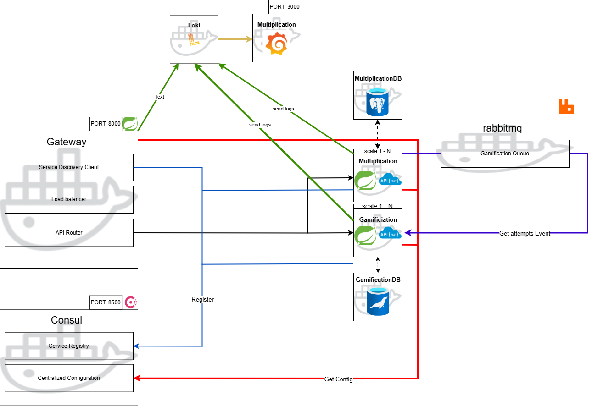

# CalcGame

**CalcGame** is a gamified backend application for math challenge operations (currently focused on multiplication). It uses a microservices/event-driven architecture built with Docker Compose (see `docker-compose.yml`) and follows cloud patterns to ensure scalability and auto-configuration.

## Features

- **Microservices Architecture**: Each service is modular and independent.
- **Event-Driven Communication**: Services interact asynchronously via RabbitMQ.
- **Cloud Patterns**: Designed for scalability and resilience, with easy auto-configuration.

## How to Run
```bash
docker compose up -d --build
```

## How to scale
```bash
docker compose up -d --scale gamification=5 --scale multiplication=5 --no-deps
```

The project is managed using Docker Compose. Follow the instructions in the `docker-compose.yml` file to build and deploy the application.

### Notes:
1. The `gateway`, `gamification`, `multiplication`, and `logs` projects include their own `Dockerfile` for building and deployment.
2. The `consult` service has a custom `Dockerfile` as the latest version is not available in an official image.
3. Services such as `rabbitmq`, `postgres`, and `mariadb` use official images from their respective repositories.

## Architecture Overview

CalcGame is structured as a **microservices architecture** with an **event-driven design** to ensure flexibility, scalability, and modularity. Below is an overview of the communication flow between the services:



### Core Services:
- **Gateway**: Routes client requests to the appropriate microservices.
- **Gamification**: Handles logic related to user achievements and rewards.
- **Multiplication**: Processes math challenges and evaluates user responses.
- **Logs**: Centralized logging for better traceability.
- **Consult**: Performs additional data processing using a custom Docker image.
- **Database Services**: `Postgres` and `MariaDB` are used for data persistence.
- **RabbitMQ**: Manages asynchronous communication between services.

## Technical Details

- **Java 17**: Modern language features and improved performance.
- **Maven 3.9.4**: Dependency management and project build system.
- **Spring Boot 3.3.5**: Framework for developing scalable microservices.
- **Spring Cloud 2023.0.3**: Provides tools for cloud-native applications.

For exact version details, check the `docker-compose.yml` file.

### Additional Notes:
1. **Hexagonal Architecture**: The `Gamification` and `Multiplication` services are designed with hexagonal architecture to ensure a clean separation of concerns and improved testability.
2. **ModelMapper**: Used for efficient transformation between DTOs and domain models.
3. **Micrometer Tracing**: Implements `io.micrometer[tracing-bridge-brave]` for distributed tracing and observability across services.

---
Explore, contribute, and enjoy building with CalcGame!
